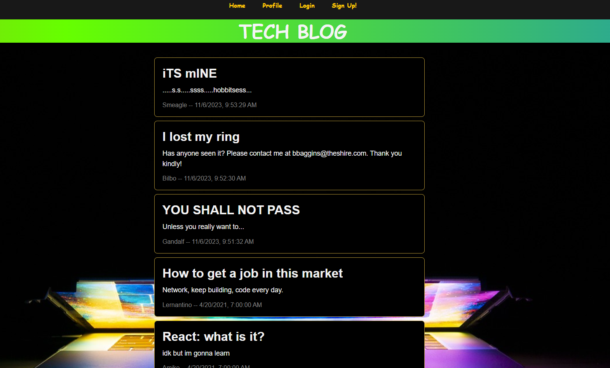
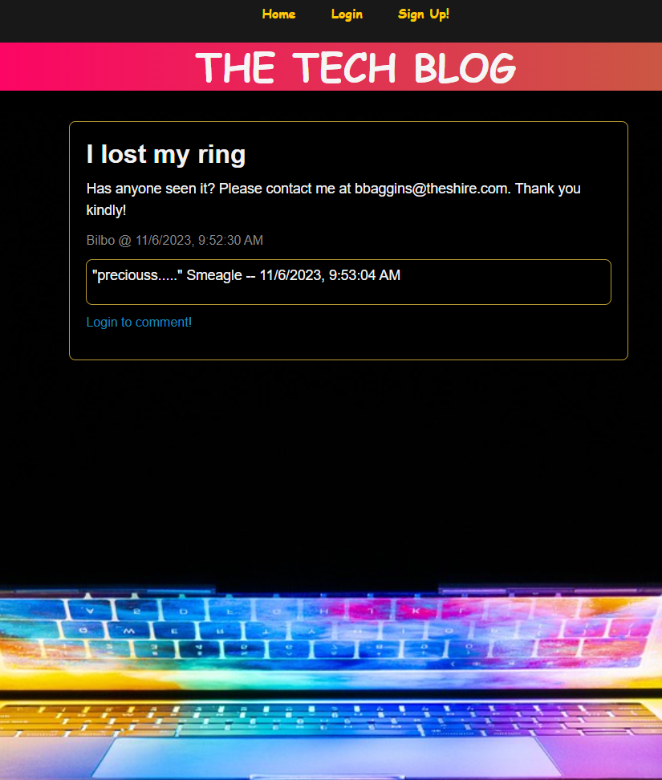
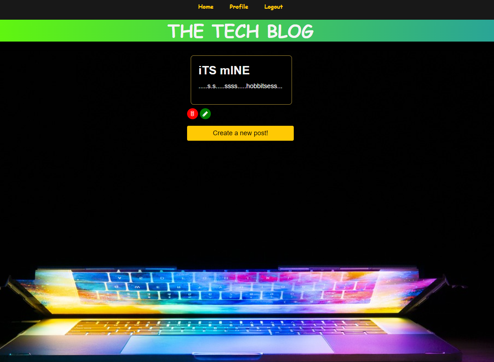

# Tech Blog 
  
## Description
  
Come visit the Tech Blog and share your thoughts about all things technology! Our fun, colorful page has a clean UI designed to get right to the heart of sharing ideas and writing about tech. Sign up today and join the fun!
  
## Table of Contents
  
-[Installation](#installation)
  
-[Usage](#usage)
  
-[License](#license)
  
-[Credits](#credits)
  
-[Contributions](#how-to-contribute)
  
## Installation
  
No installation is necessary! Simply follow [this link to the deployed application](https://afternoon-gorge-19720-60f922d0d2e8.herokuapp.com/).
  
## Usage
  
Upon loading the page, you will see all of the current blog posts listed down the middle of the page. At the top of your screen are links to the homepage, your profile, and options to sign up or login. You don't have to sign up or log in to see posts and comments but you will need to sign up and log in if you want to comment on posts or create them yourself!

Clicking on a post will bring up a new page with just that post and its comments. You will notice that each post and comment is tagged with the username of the author, as well as the time and date of writing. If you aren't logged in yet, you will see a link after the comments prompting you to log in already!

The login and sign up screens are simple and easy to follow. Choose your username, enter your email and password, and you will be logged in.

Finally, clicking on your profile (while logged in) will direct you to a page with all of your posts. You may click the red trash can just below a post to delete it; or, select the green pencil to edit and re-upload a post at any time.

## License

[This project uses the following license: MIT](https://opensource.org/licenses/MIT)

## How to Contribute
  
Please contact me on github or through my email listed below if you have any ideas or want to help extend my project!

## Questions

[Please follow this link to my GitHub profile!](https://github.com/kurtriecken)

For any additional questions, please [email me here.](mailto:kurt.riecken@gmail.com)

## Credits
  
[Kurt Riecken](https://github.com/kurtriecken)